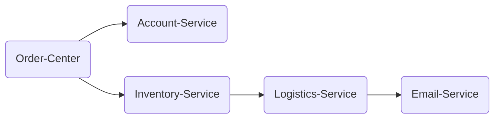

# Demo for TSW

## Action

用户购买下单：
1. 用户操作app页面，发送请求到【Order-Center】服务。
2. 【Order-Center】会调用仓储服务【Inventory-Service】，请求扣减库存，
3. 【Order-Center】会调用账户服务【Account-Service】，请求扣减账户金额。
4. 【Inventory-Service】会调用物流服务【Logistics-Service】，执行发货（不操作数据库，有一个发货的方法即可）
5. 【Logistics-Service】调用电子邮件服务【Email-Service】，给用户发送消息通知已接到订单，准备发货。

## Construction



### Deploy

#### Directory

PS: account、email、inventory、logistics和order目录可以在不同主机上任意部署。
```
|-- tsw-demo
       |-- sql
       |   |-- 00_init.sql
       |-- account
       |   |-- spring-boot-account-0.0.1-SNAPSHOT.jar
       |   |-- tsw-client-package
       |       |-- tsw-agent
       |       |-- plugins
       |       |   |-- feign-9.x-plugin-0.0.1
       |       |   |-- ......
       |       |-- config
       |           |-- agent.conf
       |-- email
       |   |-- spring-boot-email-0.0.1-SNAPSHOT.jar
       |   |-- tsw-client-package
       |       |-- tsw-agent
       |       |-- plugins
       |       |   |-- feign-9.x-plugin-0.0.1
       |       |   |-- ......
       |       |-- config
       |           |-- agent.conf
       |-- inventory
       |   |-- spring-boot-inventory-0.0.1-SNAPSHOT.jar
       |   |-- tsw-client-package
       |       |-- tsw-agent
       |       |-- plugins
       |       |   |-- feign-9.x-plugin-0.0.1
       |       |   |-- ......
       |       |-- config
       |           |-- agent.conf
       |-- logistics
       |   |-- spring-boot-logistics-0.0.1-SNAPSHOT.jar
       |   |-- tsw-client-package
       |       |-- tsw-agent
       |       |-- plugins
       |       |   |-- feign-9.x-plugin-0.0.1
       |       |   |-- ......
       |       |-- config
       |           |-- agent.conf
       |-- order
           |-- spring-boot-order-0.0.1-SNAPSHOT.jar
           |-- tsw-client-package
               |-- tsw-agent
               |-- plugins
               |   |-- feign-9.x-plugin-0.0.1
               |   |-- ......
               |-- config
                   |-- agent.conf
```
#### Ready

- jdk 1.8
- mysql 5.7+
- 执行sql/00_init.sql脚本
- 如果tsw-demo模块代码存在proxy包，则需要修改proxy包下XxxRestTemplate类中发送到目标服务的ip与端口，然后修改mysql的ip和端口，最后打成jar包
- 修改{absolute_path}/tsw-demo/order/tsw-client-package/config/agent.conf文件，注意修改```agent.service_name```、```agent.namespace```、```agent.instance_identify```、```sender.secret_id```、```sender.secret_key```、```sender.etl_ip```、```sender.etl_port```等参数

#### Run

以spring-boot-order：
- 如果是前台启动jar包：```java -javaagent:{absolute_path}/tsw-demo/order/tsw-client-package/tsw-agent.jar -jar {absolute_path}/tsw-demo/order/spring-boot-order-0.0.1-SNAPSHOT.jar```
- 如果是后台启动jar包```nohup java -javaagent:{absolute_path}/tsw-demo/order/tsw-client-package/tsw-agent.jar -jar {absolute_path}/tsw-demo/order/spring-boot-order-0.0.1-SNAPSHOT.jar &```

## CURL

> 注意修改{IP}

```curl
curl --location --request POST '{IP}:19100/order/create' \
--header 'Content-Type: application/json' \
-d '{
    "productId": 1,
    "qty": 1,
    "accountId": 1
}'
```
