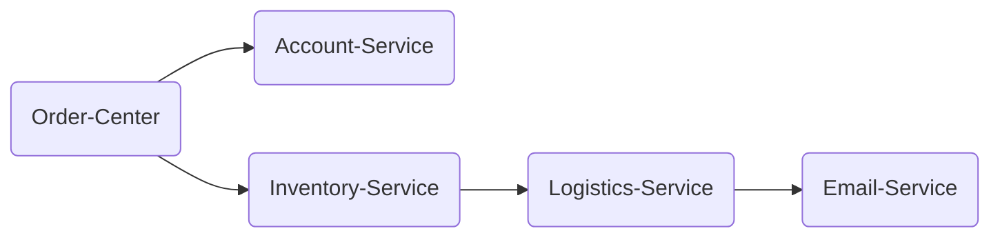

# Demo for TSW

## Action

用户购买下单：
1. 用户操作app页面，发送请求到【Order-Center】服务。
2. 【Order-Center】会调用仓储服务【Inventory-Service】，请求扣减库存，
3. 【Order-Center】会调用账户服务【Account-Service】，请求扣减账户金额。
4. 【Inventory-Service】会调用物流服务【Logistics-Service】，执行发货（不操作数据库，有一个发货的方法即可）
5. 【Logistics-Service】调用电子邮件服务【Email-Service】，给用户发送消息通知已接到订单，准备发货。

## Construction



### Deploy

#### Directory

PS: account、email、inventory、logistics和order目录可以在不同主机上任意部署。
```
|-- tsw-demo
       |-- sql
       |   |-- 00_init.sql
       |-- account
       |   |-- spring-boot-account-0.0.1-SNAPSHOT.jar
       |   |-- tsw-client-package
       |       |-- tsw-agent
       |       |-- plugins
       |       |   |-- feign-9.x-plugin-0.0.1
       |       |   |-- ......
       |       |-- config
       |           |-- agent.conf
       |-- email
       |   |-- spring-boot-email-0.0.1-SNAPSHOT.jar
       |   |-- tsw-client-package
       |       |-- tsw-agent
       |       |-- plugins
       |       |   |-- feign-9.x-plugin-0.0.1
       |       |   |-- ......
       |       |-- config
       |           |-- agent.conf
       |-- inventory
       |   |-- spring-boot-inventory-0.0.1-SNAPSHOT.jar
       |   |-- tsw-client-package
       |       |-- tsw-agent
       |       |-- plugins
       |       |   |-- feign-9.x-plugin-0.0.1
       |       |   |-- ......
       |       |-- config
       |           |-- agent.conf
       |-- logistics
       |   |-- spring-boot-logistics-0.0.1-SNAPSHOT.jar
       |   |-- tsw-client-package
       |       |-- tsw-agent
       |       |-- plugins
       |       |   |-- feign-9.x-plugin-0.0.1
       |       |   |-- ......
       |       |-- config
       |           |-- agent.conf
       |-- order
           |-- spring-boot-order-0.0.1-SNAPSHOT.jar
           |-- tsw-client-package
               |-- tsw-agent
               |-- plugins
               |   |-- feign-9.x-plugin-0.0.1
               |   |-- ......
               |-- config
                   |-- agent.conf
```
#### Ready

- jdk 1.8 (推荐Kona JDK)
- mysql 5.7+ (推荐腾讯云CDB产品)
- redis (推荐腾讯云Redis产品)
- kafka (推荐腾讯云CKafka产品)
- 执行sql/00_init.sql脚本

#### Run

该demo适用于javaagent的启动。

1. 命令行参数配置（推荐）

${xxx}内的xxx需要自行填写对应配置参数。

1.1 spring-boot-order
- 前台启动jar包：
```
java -javaagent:${absolute_path_1}/xxx-agent.jar -jar ${absolute_path_2}/spring-boot-order-1.0.jar \
-Xms128m -Xmx128m -XX:MaxMetaspaceSize=128m \
--db.host=${db.host} --db.port=${db.port} --db.username=${db.username} --db.password=${db.password} \
--account.url=${account.url} --inventory.url=${inventory.url}
```
- 后台启动jar包
```
nohup java -javaagent:${absolute_path_1}/xxx-agent.jar -jar ${absolute_path_2}/spring-boot-order-1.0.jar \
-Xms128m -Xmx128m -XX:MaxMetaspaceSize=128m \
--db.host=${db.host} --db.port=${db.port} --db.username=${db.username} --db.password=${db.password} \
--account.url=${account.url} --inventory.url=${inventory.url} >/dev/null 2>&1 &
```

1.2 spring-boot-account
- 前台启动jar包：
```
java -javaagent:${absolute_path_1}/xxx-agent.jar -jar ${absolute_path_2}/spring-boot-account-1.0.jar \
-Xms128m -Xmx128m -XX:MaxMetaspaceSize=128m \
--db.host=${db.host} --db.port=${db.port} --db.username=${db.username} --db.password=${db.password}
```
- 后台启动jar包
```
nohup java -javaagent:${absolute_path_1}/xxx-agent.jar -jar ${absolute_path_2}/spring-boot-account-1.0.jar \
-Xms128m -Xmx128m -XX:MaxMetaspaceSize=128m \
--db.host=${db.host} --db.port=${db.port} --db.username=${db.username} --db.password=${db.password} \
>/dev/null 2>&1 &
```

1.3 spring-boot-inventory
- 前台启动jar包：
```
java -javaagent:${absolute_path_1}/xxx-agent.jar -jar ${absolute_path_2}/spring-boot-inventory-1.0.jar \
-Xms128m -Xmx128m -XX:MaxMetaspaceSize=128m \
--db.host=${db.host} --db.port=${db.port} --db.username=${db.username} --db.password=${db.password} \
--logistics.url=${logistics.url}
```
- 后台启动jar包
```
nohup java -javaagent:${absolute_path_1}/xxx-agent.jar -jar ${absolute_path_2}/spring-boot-inventory-1.0.jar \
-Xms128m -Xmx128m -XX:MaxMetaspaceSize=128m \
--db.host=${db.host} --db.port=${db.port} --db.username=${db.username} --db.password=${db.password} \
--logistics.url=${logistics.url} >/dev/null 2>&1 &
```

1.4 spring-boot-logistics
- 前台启动jar包：
```
java -javaagent:${absolute_path_1}/xxx-agent.jar -jar ${absolute_path_2}/spring-boot-logistics-1.0.jar \
-Xms128m -Xmx128m -XX:MaxMetaspaceSize=128m \
--redis.host=${redis.host} --redis.port=${redis.port} --redis.password=${redis.password} \
--kafka.servers=${kafka.servers} --kafka.username=${kafka.username} --kafka.password=${kafka.password} \
--logistics.topic=${logistics.topic}
```
- 后台启动jar包
```
nohup java -javaagent:${absolute_path_1}/xxx-agent.jar -jar ${absolute_path_2}/spring-boot-logistics-1.0.jar \
-Xms128m -Xmx128m -XX:MaxMetaspaceSize=128m \
--redis.host=${redis.host} --redis.port=${redis.port} --redis.password=${redis.password} \
--kafka.servers=${kafka.servers} --kafka.username=${kafka.username} --kafka.password=${kafka.password} \
--logistics.topic=${logistics.topic} >/dev/null 2>&1 &
```

1.5 spring-boot-email
- 前台启动jar包：
```
java -javaagent:${absolute_path_1}/xxx-agent.jar -jar ${absolute_path_2}/spring-boot-email-1.0.jar \
-Xms128m -Xmx128m -XX:MaxMetaspaceSize=128m \
--redis.host=${redis.host} --redis.port=${redis.port} --redis.password=${redis.password} \
--kafka.servers=${kafka.servers} --kafka.username=${kafka.username} --kafka.password=${kafka.password} \
--email.topic=${email.topic}
```
- 后台启动jar包
```
nohup java -javaagent:${absolute_path_1}/xxx-agent.jar -jar ${absolute_path_2}/spring-boot-email-1.0.jar \
-Xms128m -Xmx128m -XX:MaxMetaspaceSize=128m \
--redis.host=${redis.host} --redis.port=${redis.port} --redis.password=${redis.password} \
--kafka.servers=${kafka.servers} --kafka.username=${kafka.username} --kafka.password=${kafka.password} \
--email.topic=${email.topic} >/dev/null 2>&1 &
```

2. 项目内修改参数

修改完参数后打包运行。
- 前台启动jar包：
```
java -javaagent:${absolute_path_1}/xxx-agent.jar -jar ${absolute_path_2}/spring-boot-xxx-1.0.jar \
-Xms128m -Xmx128m -XX:MaxMetaspaceSize=128m
```
- 后台启动jar包
```
nohup java -javaagent:${absolute_path_1}/xxx-agent.jar -jar ${absolute_path_2}/spring-boot-xxx-1.0.jar \
-Xms128m -Xmx128m -XX:MaxMetaspaceSize=128m >/dev/null 2>&1 &
```

## CURL

> 默认为本机，注意修改IP

```curl
curl --location --request POST '127.0.0.1:19100/order/create' \
--header 'Content-Type: application/json' \
-d '{
    "productId": 1,
    "qty": 1,
    "accountId": 1
}'
```

## Auto Run CURL

1. 修改```curl_cron.sh```文件

主要关注```step```（几秒一次）和```curl```后的参数设置

2. 设置cron定时任务，注意定时执行的脚本的路径设置

```shell
# 设置cron定时任务
crontab -e

# 填写如下定时任务配置
* * * * * /bin/sh /root/tsw-demo/order/curl_cron.sh > /root/tsw-demo/order/cron.log
```