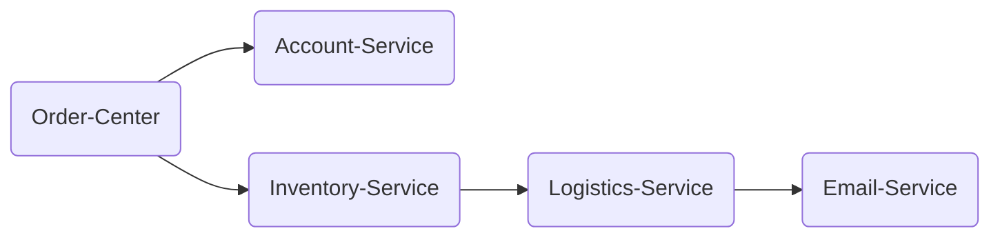

# Demo for TSW

## Action

用户购买下单：
1. 用户操作app页面，发送请求到【Order-Center】服务。
2. 【Order-Center】会调用仓储服务【Inventory-Service】，请求扣减库存，
3. 【Order-Center】会调用账户服务【Account-Service】，请求扣减账户金额。
4. 【Inventory-Service】会调用物流服务【Logistics-Service】，执行发货（不操作数据库，有一个发货的方法即可）
5. 【Logistics-Service】调用电子邮件服务【Email-Service】，给用户发送消息通知已接到订单，准备发货。

## Construction



### Deploy

#### Directory

PS: account、email、inventory、logistics和order目录可以在不同主机上任意部署。
```
|-- assembly-1.0-tsw-demo-spring-cloud-zipkin
       |-- start.sh
       |-- curl_cron.sh
       |-- README.md
       |-- sql
       |   |-- 00_init.sql
       |-- spring-cloud-zipkin-account-1.0.jar
       |-- spring-cloud-zipkin-email-1.0.jar
       |-- spring-cloud-zipkin-inventory-1.0.jar
       |-- spring-cloud-zipkin-logistics-1.0.jar
       |-- spring-cloud-zipkin-order-1.0.jar
```
#### Ready

- jdk 1.8
- mysql 5.7+
- 执行sql/00_init.sql脚本
- redis
- kafka

修改`start.sh`脚本的这一部分:
``` shell
db_host=""
db_port="3306"
db_username="root"
db_password=""

redis_host=""
redis_port="6379"
redis_password=""

zipkin_url=""

kafka_servers=""
kafka_username=""
kafka_password=""
```

#### Run

执行以下命令启动

```shell
start.sh [ all | order | account | inventory | logistics | email ]
```

## CURL

> 默认为本机，注意修改IP

```curl
curl --location --request POST '127.0.0.1:19110/order/create' \
--header 'Content-Type: application/json' \
-d '{
    "productId": 1,
    "qty": 1,
    "accountId": 1
}'
```

## Auto Run CURL

1. 修改```curl_cron.sh```文件

主要关注```step```（几秒一次）和```curl```后的参数设置

2. 设置cron定时任务，注意定时执行的脚本的路径设置

```shell
# 设置cron定时任务
crontab -e

# 填写如下定时任务配置
* * * * * /bin/sh /root/tsw-demo/order/curl_cron.sh > /root/tsw-demo/order/cron.log
```
